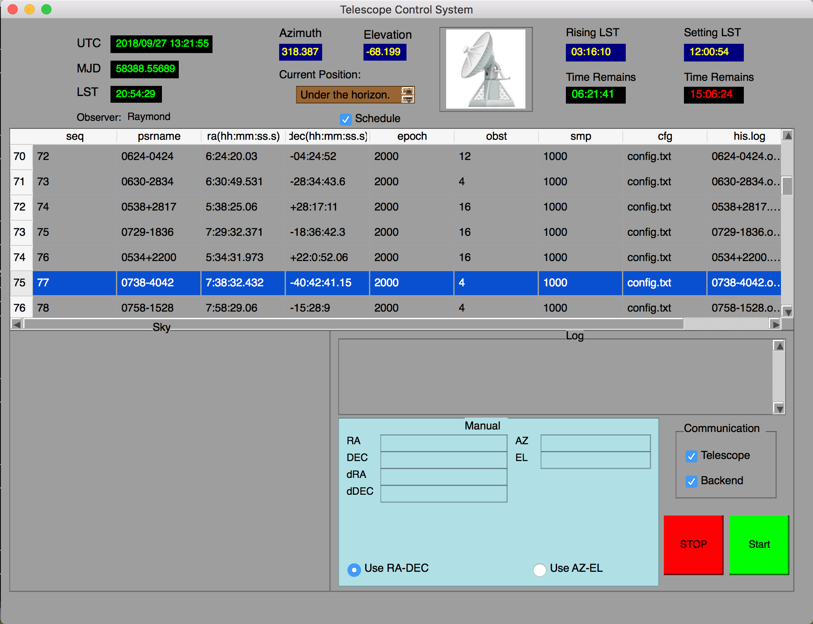

# Telescope-Control-System User Interface
This is an example of TCS UI.

## Display the rising and setting time for particular radio source, and its celestial coordinate position in real-time.

## Launch:

$ ./Tcr_system
